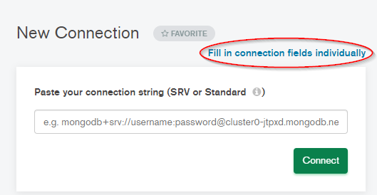
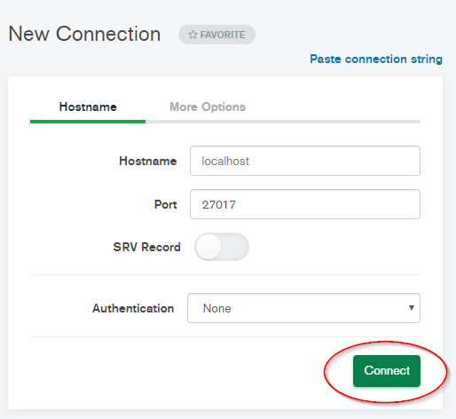
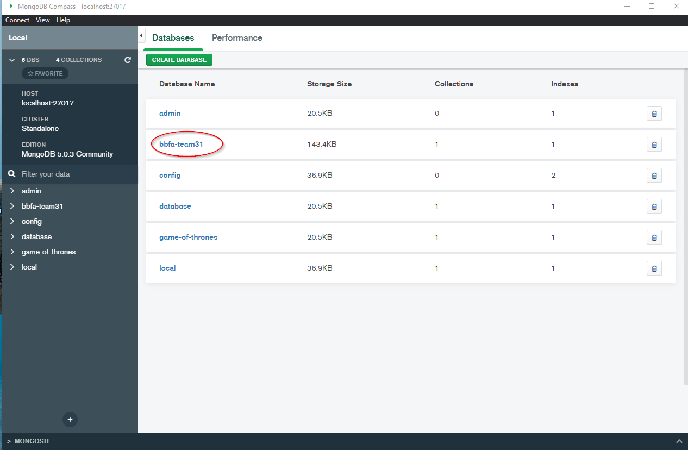
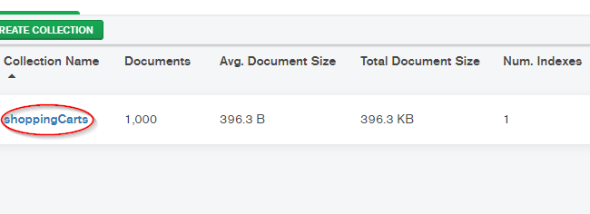
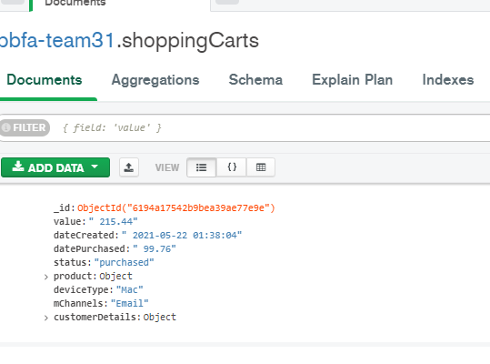

# Project

# How to run

```bash
# Create a virtual env
python3 -m venv team31-bbfa

# Source the virtual env, on windows:
team31-bbfa\Scripts\activate

# On Unix, MacOS
source team31-bbfa/bin/activate

# Install the requirements
python -m pip install -r requirements.txt

# Run the app
python app.py

```

# To create or reset the database,

```bash
# Delete old sqlite file DB
rm bbfa-db.db
# Use script to create new sqlite file DB
python db.py

```

# NoSQL portion

# Start MongoDB locally
```bash
# cd to your local MongoDB server (C:\Program Files\MongoDB\Server\5.0\bin)
cd $(PATH)
# Start local mongoDB server
mongod
```

# Connect to MongoDB server using MongoDB Compass
`Open MongoDB Compass -> Fill in connection fields individualy -> follow image -> connect`




# Insert data
```
# make sure you have pymongo library install, pip install pymongo
cd individual-scripts
python insertCatnPord.py
```

# View the collection




# Connect to Mongo Server programmatically to do CRUD (python)
```
# imports
from pymongo import MongoClient
# connect to local mongodb
connection_string = "mongodb://localhost:27017/bbfa-team31"
client = MongoClient(connection_string)
db = client.get_database("bbfa-team31")
collection = db.get_collection("shoppingCarts")
# mongoDb queries
collection.insert_many()
collection.find()
```